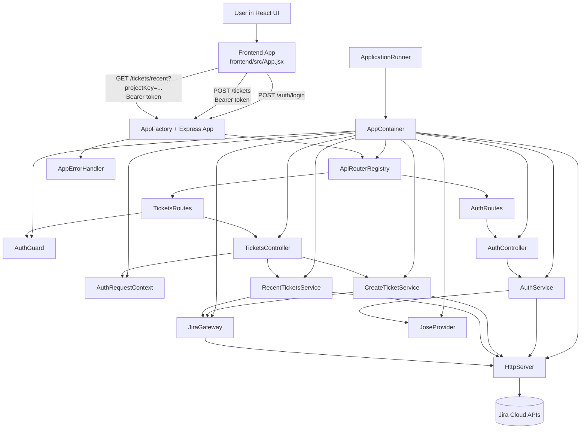

# App Design Notes

This document is the single source of truth for product/design considerations that are not part of development setup.

## Current Product Goal

Build a multi-user application that integrates with Jira so each signed-in user can securely connect and use their own Jira workspace.

## Design Considerations

### Authentication

#### Decision Summary

- Chosen approach for assignment MVP: stateless backend authentication using Jira email + Jira API token.
- User first creates a Jira API token in Atlassian settings.
- User authenticates directly against Jira via our backend (`/auth/login` pre-flight call to Jira `/rest/api/3/myself`).
- On successful validation, backend issues a short-lived, signed token that encapsulates Jira credentials for follow-up requests.
- Backend remains stateless: no server-side session store and no user database for auth state in this phase. This means that token invalidation can only be done Jira API token revocation.
- Jira OAuth 2.0 remains the long-term production path; API-token flow is selected now for speed, simplicity, and reviewability.

## Backend

0. **User preparation (external)**  
   User creates a Jira API token in Atlassian settings. This is done in https://id.atlassian.com/manage-profile/security/api-tokens.

1. **Authentication and token exchange (`POST /auth/login`)**  
   Request includes `email` and `jiraApiToken` in its body.
   Backend validates via Jira `GET /rest/api/3/myself`, then issues a signed/encrypted app token.

2. **Create finding ticket (`POST /tickets`)**  
   Request includes Bearer token and payload with `projectKey`, `title`, and `description`.  
   Backend extracts Jira credentials from app token, creates issue in Jira, and adds app label (for example `identityhub-finding`).

3. **Fetch recent tickets (`GET /tickets/recent`)**  
   Request includes Bearer token and `projectKey` as query param.  
   Backend runs JQL in Jira and returns top 10:
   `project = "{projectKey}" AND labels = "identityhub-finding" ORDER BY created DESC`.

4. **Logout (stateless)**  
   Client deletes/stops sending app token; server keeps no auth session state.

**Why this shape was chosen**
- No separate "set current project" endpoint is required.
- Same user can target different Jira projects across calls.
- Backend stays stateless because request context carries both auth and project scope.

#### Main Dilemmas Discussed

- **OAuth 2.0 vs API token**: OAuth is more production-grade but heavier to configure for an assignment; API token is faster and frictionless.
- **Stateful vs stateless backend**: stateful sessions/DB improve revocation and lifecycle control; stateless reduces setup and operational complexity.
- **Where to keep Jira credentials**: storing credentials server-side is safer for revocation/control; self-contained token is simpler but needs strict security controls.
- **How to support recent tickets without DB**: use Jira-side metadata (label) + JQL query instead of local persistence.
- **Simplicity vs heavier recent-ticket fetch**: stateless design keeps implementation simple, but `GET /tickets/recent` will be heavier because each call depends on Jira search/JQL work instead of a locally cached or persisted history table.
- **Logout semantics**: app logout is client-side token deletion; Jira API tokens cannot be revoked programmatically by a normal integration.

#### Security Requirements For This Choice

- HTTPS/TLS is mandatory for all endpoints.
- Use short token expiration to reduce replay window.
- Sign tokens with strong server secret; do not commit secrets.

### Error handler
- Added a general error handler to catch errors that our thrown explicitly, as well as internal errors that aren't handled properly.

### High-Level Components Overview

- The backend follows a class-based, dependency-injected architecture end-to-end (container + route/controller/service split).
- `AppContainer` acts as the composition root and wires singleton-like instances once on startup.
- `ApplicationRunner` owns startup lifecycle and process-level crash guards.
- Clear separation between Controllers handling HTTP concerns, and Services handling business logic. This is cleaner, easier to reuse, and more easily testable.

### Auth and Token Handling

- `AuthService` validates Jira credentials and issues/verifies the app auth token.
- `jose` loading was extracted out of `AuthService` into an injectable `JoseProvider` to separate module-loading concerns from auth domain logic.
- Auth request-context extraction (`req.authUser`) moved out of `TicketsController` into dedicated middleware helper `AuthRequestContext`.
- Auth middleware files are grouped under `src/middleware/auth`.

### Ticket Domain Refactor

- Ticket logic was split out of controller-level implementation into dedicated services:
  - `CreateTicketService`
  - `RecentTicketsService`
- Shared Jira-related concerns were extracted into `JiraGateway`:
  - Jira base URL resolution
  - Basic auth construction
  - project key validation
  - Jira credential failure mapping
  - Jira error payload parsing
- `TicketsController` now focuses on request validation and delegating to services.

### HTTP Access Abstraction

- Direct `fetch` calls were centralized behind `HttpServer`.
- `AuthService`, `JiraGateway`, `CreateTicketService`, and `RecentTicketsService` use this shared HTTP abstraction.
- This creates a single place to add cross-cutting HTTP behavior later (timeouts, retries, tracing, metrics).

### Middleware and Error Handling Structure

- Error-related middleware was moved into a dedicated subdirectory, encapsulated inside `AppErrorHandler` static methods:
  - `src/middleware/errorHandlers/AppHttpError.ts`
  - `src/middleware/errorHandlers/appErrorHandler.ts`
  - `src/middleware/errorHandlers/createHttpError.ts`
  - `src/middleware/errorHandlers/errorHandler.ts`
- Auth middleware is now grouped in:
  - `src/middleware/auth/authGuard.ts`
  - `src/middleware/auth/authRequestContext.ts`

### Testing and Validation Status

- Test suite was split by API surface and expanded:
  - `auth.login` coverage
  - `tickets.create` coverage (including missing/invalid auth header scenarios)
  - `tickets.recent` coverage (including label filtering behavior)
- Dedicated `errorHandlers` test suite covers:
  - factory creation (`createHttpError`)
  - production masking for 5xx
  - non-production stack behavior
  - fallback conversion for generic errors
  - dynamic status/code/details propagation
  - invalid status fallback to 500
- Build/lint/tests are passing after these refactors.

## Frontend

This stage adds a browser UI on top of the existing stateless backend flow.

### Frontend Scope Implemented (React UI)

- Login screen that calls `POST /auth/login` with:
  - Jira email
  - Jira API token
- NHI finding creation form:
  - project key input (user writes/selects key)
  - title (summary)
  - description
  - submits to `POST /tickets`
- Recent tickets view:
  - calls `GET /tickets/recent?projectKey=...`
  - shows ticket title and creation timestamp

### Frontend Token Handling

- Backend app token is returned by `/auth/login` response body.
- Frontend stores this token in runtime state and automatically attaches it as Bearer auth for ticket APIs.
- UI does not ask user to re-enter token manually for each request.
- If login does not succeed, token is not set and ticket requests will fail with auth errors.

### Validation Expectations in UI

- Basic required-field validation exists on forms (browser + component checks).
- Backend remains source of truth for business/security validation:
  - missing/invalid auth header
  - invalid Jira credentials
  - invalid project key
  - payload validation and downstream Jira errors
- UI surfaces backend error payload messages.

### Frontend Runtime

- Frontend stack: React + Vite in `frontend/`.
- Local dev URL is `http://localhost:5173`.
- Vite proxies `/auth` and `/tickets` to backend `http://localhost:3000` in development.

## E2E Flow Diagram

### How Components Interact

1. **Startup composition**
   - `ApplicationRunner` creates `AppContainer`, which wires all classes once (controllers, middleware, services, providers, gateways).
   - `AppFactory` creates Express app and mounts routes from `ApiRouterRegistry`.

2. **Login path (`POST /auth/login`)**
   - Frontend submits Jira email + Jira API token.
   - `AuthController` validates input and calls `AuthService`.
   - `AuthService` uses `HttpServer` to validate Jira credentials (`/rest/api/3/myself`) and `JoseProvider` to issue encrypted/signed app token.
   - Token returns to frontend and is used as Bearer auth for protected APIs.

3. **Protected path (`POST /tickets`, `GET /tickets/recent`)**
   - `AuthGuard` parses Bearer token, verifies it via `AuthService`, and stores user context on request.
   - `TicketsController` reads authenticated user through `AuthRequestContext`, validates request fields, and delegates to ticket services.
   - `CreateTicketService` / `RecentTicketsService` use `JiraGateway` + `HttpServer` to call Jira APIs.

4. **Jira interaction abstraction**
   - `HttpServer` centralizes outbound HTTP calls.
   - `JiraGateway` centralizes Jira-specific shared logic (base URL, project validation, credential response checks, error parsing).

5. **Error propagation**
   - Any thrown/async errors flow to `AppErrorHandler` middleware.
   - Error handler normalizes payloads, masks 5xx errors in production, and returns consistent JSON error responses.